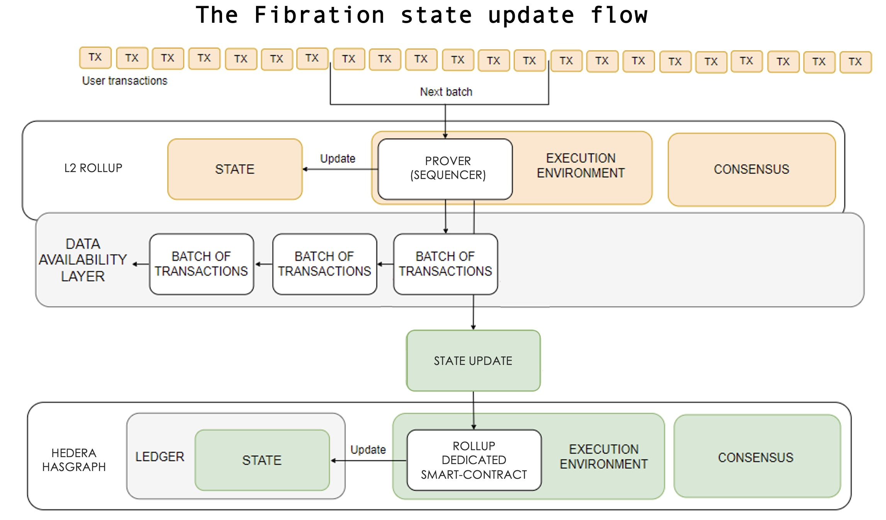

# Fibration: Hedera Hashgraph RAAS Platform

Welcome to Hedera's Rollup as a Service (RAAS) platform! This innovative solution empowers developers to create scalable, efficient, and compliant networks tailored to the modern multi-chain environment. Hedera RAAS overcomes the limitations of traditional, centralized Layer 2 designs by offering customizable smart contracts, fixed costs, and instant settlement options. Whether you're building a new decentralized ecosystem or enhancing an existing one, Hedera RAAS provides the tools you need to succeed.

## Table of Contents
- [Overview](#overview)
- [Key Components](#key-components)
  - [Data Availability](#data-availability)
  - [State Management](#state-management)
  - [Logging State Transitions](#logging-state-transitions)
  - [Anchoring State](#anchoring-state)
- [Contract Interface](#contract-interface)
  - [commitState](#commitstate)
  - [getStateRoot](#getstateroot)
  - [processNewState](#processnewstate)
- [Example Workflow](#example-workflow)
  - [Creating a Rollup](#creating-a-rollup)
  - [Verifying State](#verifying-state)
  - [Interacting with the Execution Environment](#interacting-with-the-execution-environment)
- [Integration Strategy](#integration-strategy)
- [Transaction Workflow](#transaction-workflow)
- [Getting Started](#getting-started)
- [Documentation and Resources](#documentation-and-resources)

## Overview
Hedera RAAS is your gateway to creating and monetizing unique ecosystems effortlessly. With the power of Hedera Hashgraph, you can build decentralized networks that are not only scalable and efficient but also compliant with the latest standards. The RAAS platform provides everything you need to launch and manage your Layer 2 solutions, from customizable smart contracts to transparent and predictable pricing.

## Key Components

### Data Availability
All contract state data, such as the `currentStateHash`, is available for viewing and verification. The contract ensures the constant availability of the state hash, which can be verified through Hedera's network. This data availability is crucial for developers who need to ensure the integrity and transparency of the rollup states within their applications.

### State Management
The contract manages state transitions through the `commitState` function, which updates the state hash (Merkle root) and logs it on the Hedera network. Additionally, the `processNewState` function allows the execution environment to interact with the contract, updating the latest state based on external inputs.

### Logging State Transitions
The internal `logStateTransition` function leverages the Hedera Consensus Service (HCS) to record the state and its corresponding timestamp. This logging ensures that the state transitions are not only verifiable but also permanently stored on Hedera, making them available for subsequent verification.

### Anchoring State
The contract records the state hash and timestamp on Hedera via the Hedera Consensus Service (HCS), ensuring that this data can be used for state verification and recovery. By anchoring the state on Hedera, developers can maintain a robust audit trail that supports the integrity of their decentralized applications.

## Contract Interface

The `Fibration` smart contract exposes several key functions that developers can use to interact with the Hedera network:

### `commitState(bytes32 _merkleRoot)`
This function allows developers to submit the Merkle root of their batched transactions to the Hedera network. The submitted state is recorded on the network and associated with a unique batch ID.

### `getStateRoot(uint256 _batchId)`
This function enables developers to retrieve the Merkle root associated with a specific batch ID. This is crucial for verifying the integrity of the transactions in a given rollup.

### `processNewState(bytes32 _newState)`
This function is designed to be called by the execution environment. It updates the `latestState` variable in the smart contract based on external inputs, allowing for additional state processing that can be triggered by off-chain systems.

## Example Workflow

### Creating a Rollup
1. **Deploy** a new instance of the `Fibration` contract.
2. **Batch Transactions**: Implement off-chain logic to collect transactions and compute the Merkle root.
3. **Commit State**: Use the `commitState` function to store the Merkle root on the Hedera network.

### Verifying State
1. **Retrieve Merkle Root**: Use the `getStateRoot` function to obtain the Merkle root for the desired batch ID.
2. **Verify Transactions**: Use the retrieved Merkle root to verify transactions against it in your application.

### Interacting with the Execution Environment
1. **Trigger State Processing**: After verifying the state, call the `processNewState` function to update the contract’s state with additional data from the execution environment.
2. **Monitor Events**: Listen for the `StateProcessed` event to confirm that the new state has been processed successfully.

## Integration Strategy
For a detailed guide on integrating and deploying smart contracts on the Hedera network, refer to the official Hedera documentation.

## Transaction Workflow

1. **Transactions**: Developers collect transactions off-chain within their application and compute the Merkle root for these transactions.
2. **State Commitment**: Submit the computed Merkle root to the `commitState` function of your smart contract. This action "publishes" the rollup's state onto the Hedera network.
3. **State Verification**: Retrieve the state commitments using the `getStateRoot` function to verify the integrity of transactions within your application.
4. **Execution Environment Interaction**: Use the `processNewState` function to interact with the smart contract from the execution environment, processing the new state data and updating the contract accordingly.

## Getting Started

To get started with Hedera RAAS, follow these steps:

1. Clone this repository to your local environment.
2. Deploy the `Fibration` contract using the provided deployment scripts.
3. Implement off-chain logic for transaction batching and state commitment.
4. Use the provided contract interface to interact with your deployed contract.
5. Integrate the execution environment logic to trigger and process state updates.
---

Join the next generation of decentralized innovation with Fibration: Hedera Hashgraph RAAS Platform and revolutionize how Layer 2 solutions are built and managed!